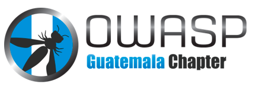

---

layout: col-sidebar
title: OWASP Guatemala
meetup: owasp-guatamala-meetup-group 
tags:  Guatemala
region: Central America
meetup-group: owasp-guatemala-meetup-group
---

# Bienvenidos al Capitulo OWASP de Guatemala

El objetivo del capitulo OWASP de Guatemala es concientizar acerca de las vulnerabilidades que pueden afectar a las aplicaciones y sobre como remediarlas o evitarlas. Buscamos difundir temas de Seguridad en Aplicaciones Web, concientizar y sensibilizar tanto a organizaciones, empresas, Universidades, estudiantes, desarrolladores y arquitectos. Esta difusión se realiza mediante eventos de capacitación y de charlas.

## Reuniones

Se proponen reuniones trimestrales y grupos de estudio a formarse
relacionados en temas de Seguridad Informatica. Se nombran alguno de
ellos:

  - Análisis de las nuevas tecnologías de la información y las
    comunicaciones.
  - Análisis de productos (Software & Appliances).
  - Investigación de fallas y vulnerabilidades.
  - Desarrollo de programas y técnicas de exploit relacionadas.
  - Documentación de soluciones de seguridad.
  - Desarrollo de herramientas de seguridad.
  - Demostraciones. Debates y desarrollo investigativo.

## Colabora

Hay muchas formas de colaborar y contribuir con el capitulo OWASP
Guatemala.

  - Participando en cualquiera de los proyectos actualmente activos
    (documentación y herramientas).
  - Proponiendo nuevos proyectos.
  - Participando y aportando ideas en nuestra lista de correo.
  - Asistiendo a las conferencias y reuniones.
  - Promoviendo y dando soporte al proyecto OWASP en general.
  - Coffee Breaks y rifas en nuestros eventos.

## Social media
* [Facebook Page](https://www.facebook.com/owaspgt/) 
* [Meetup](https://www.meetup.com/owasp-guatemala-meetup-group/) 

## Hablar en Eventos de OWASP Guatemala
Siempre estamos buscando Speakers, si tienes alguna charla que puedes dar y quieres hacerlo en nuestros eventos por favor comunicate con los líderes del capitulo. 

## Meeting Sponsors
Esta es la lista de algunas de las organizaciones que apoyan el capitulo OWASP Guatemala

### Check our Upcoming [Meetup Events](https://www.meetup.com/owasp-guatemala-meetup-group)

## Proximos eventos - Meetup



